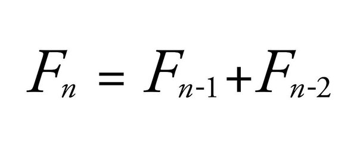

# Lab 08: Recursion

Welcome to CSC 211 Lab 08. Your goal for this lab will be to gain a better understanding of recursion and its uses. **Be sure to read and follow all instructions unless otherwise specified.**  Create a `lab-08.txt` document to record all of your lab answers in and implement all of your `.cpp` programs in your IDE.

1. Simple Recursion<br> 
2. Recursion Programming Problems
3. Recursive Stack Behavior
4. Advanced Recursion<br>

# 1. Simple Recursion

What is recursion? Recursion is a problem solving method about taking a problem and breaking it into smaller versions of itself. As a classic example, the fibonacci sequence is a recursive sequence. In that it is a sequence dependant on simpler versions of itself. Below is an image of the formula to calculate the n-th fibonacci number:



Where the n-th fibonacci number is calculated by summing the previous two fibonacci numbers. This formula presents a problem immeadiately, how does the formula know when to stop? What are the two initial values for the formula? This is a concept we will refer to from this point forward as a **base case**, the values or condition that tells a recursive function to stop recursing. For this example we will use 0 and 1 as our two base numbers for this formula. So F0 = 0 and F1 = 1. This now enables us to calculate any other fibonacci number.

:white_check_mark: Question 1. Given the above base cases, what is the value of F6, the 6th fibonacci number.

What implications does this have for programming? We can use recursion to perform calculations like this. It also has the side effect of being able to produce very small programs that can perform advanced calculations or complex functionality. We can accomplish this in programming by using **functions that call themselves**, these functions effectively replicate recursion and are known as **recursive functions as a result**. We have to be very careful when writing recusive functions however, as if we aren't careful we can overflow our stack memory and cause our program to crash. Lets move on to trying to replicate the fibonacci sequence in psuedo-code.

```
function fib(number):
    if number is 0 or 1:
        return 0 or 1
    else:
        return fib(number - 1) + fib(number - 2)

```

Notice how the first if state handles our base case and the else clause makes our function recursive.

:white_check_mark: Program 1. Translate the above psuedocode into C++ and test it with fib(6), ensuring that it matches the calculation you made earlier by hand.

:white_check_mark: Question 2. What would the function call tree look like for a call of fib(6)? (It is encouraged to actually draw out the tree on paper but there is no need to try and express this image in your document. Just describe the shape of the tree)

After looking into the fibonacci sequence we will now move into some more guided programming of recursive solutions to some problems you have seen before this semester among some others. It is important however that we stress that every recursive function needs to include a base case that returns a concrete value (not a function call like the psuedo-code above) and stops the recursion process. It is also important that every recursive function has at least one line that calls itself, to actually allow recursion to take place, this function call should also make the problem simpler in some way, shape or form.

# Programming Problems

:white_check_mark: Program 2. Write a recursive function in C++ to print out the values in an integer array, with one per line. It should have the following header `void print_arr(int * arr, int n);`.

:white_check_mark: Program 3. Write a recursive function in C++ to print out the values in an integer array in reverse order, with one per line. It should have the following header `void print_rev_arr(int * arr, int n);`.

:white_check_mark: Program 4. Write a recursive function in C++ to return the sum of all value from 1 to a given number. It should have the following header `unsigned int sum(int n);`.

:white_check_mark: Program 5. Write a recursive function in C++ to return the sum of a numbers digits. It should have the following header `int sum_digits(int n);`.

:white_check_mark: Program 6. Write a recursive function in C++ to take a number and calculate the factorial of the number. It should have the following header `unsigned int fact(int n);`. For anyone unfamiliar with factorials [here is a link on what they are](https://en.wikipedia.org/wiki/Factorial). Note: these values grow extremely quickly so dont test your code on any large numbers.

:white_check_mark: Program 7. Write a recursive function in C++ to take an array of integers and calculate it sum. It should have the following header `int sum(int* arr, int n);`.

:white_check_mark: Program 8. Write a recursive function in C++ to take a std::string and determine if that string is a palindrome. It should have the following header `bool pali(std::string str);`.

:white_check_mark: Program 9. Write a recursive function in C++ to print out a pyrammid of '+' characters, similar to the ones we saw with nested loops. It should have the following header `void pyr(int levels, int current_level);`. For levels = 3 and current_level = 0 in your initial function call your function should print out:
```
+
++
+++
++
+
```

:white_check_mark: Program 10. Write a recursive function in C++ to see if a given array of integers is sorted in strictly-increasing order. It should have the following header `bool is_sorted(int* arr, int n);`.

# 3. Recursive Stack Behavior

It is important to truly understand the power of recursion we understand how these functions behave on the stack. In general, recursive functions build out long snaking stack frames that require a subsequent function call to complete. What this allows us to do is have partially completed calls to functions that resolve after a simpler version has resolved. For example copy and paste the following code into python tutor:

```c++
#include <iostream>
int fib(int n) {
  if(n < 2) {
    return n;
  }
  return fib(n-1) + fib(n-2);
}

int main() {
  std::cout << fib(6) << std::endl;
  return 0;
}
```

Notice how the stack frame continually grows and shrinks as recursive calls are made. You may remember the recursion tree for this function from last weeks lab, remembering its form may help you to answer the following questions:

:white_check_mark: Question 3: What is happening when the stack grows?

:white_check_mark: Question 4: What is happening when the stack shrinks?

# 4. Advanced Recursion

## Advanced Recursive Thinking

We can use some recursive thinking to recursively build permutations of a string. For example if we use the string 'Cat' as an example, this string has 6 permutations:

```
Cat
Cta
aCt
atC
tCa
taC
```

We can use some recursive processes to represent this problem and build our strings.

:white_check_mark: Program 11: Write a recursive function with the header `void permute_str(std::string current, std::string choices);` that will recursively build all permutations of a string it receives in main as its `choices` argument.

:white_check_mark: Program 12: Implement all possible N length binary strings.

:white_check_mark: Program 13: Find Greatest Common Divisor (GCD) of 2 numbers using recursion.

:white_check_mark: Challenge Question: Implement N-Queens

The N Queen is the problem of placing N chess queens on an N×N chessboard so that no two queens attack each other. For example, following is a solution for 4 Queen problem.

